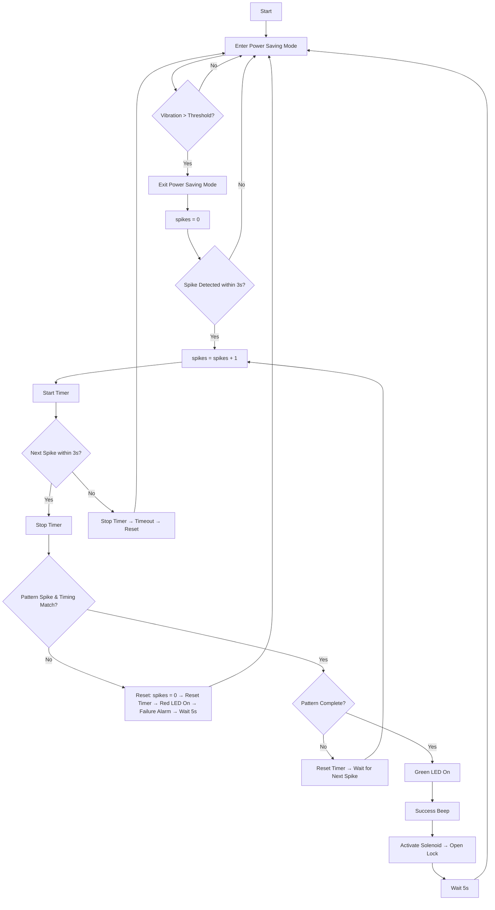

# Flowchart
The following flowchart outlines the main logic for detecting a knock:

```mermaid
flowchart TD
    %% === System Initialization ===
    A[Start] --> B[Enter Power Saving Mode]
    B --> C{Vibration > Threshold?}
    C -->|No| B
    C -->|Yes| D[Exit Power Saving Mode]

    %% === Knock Detection Loop ===
    D --> F[spikes = 0]
    F --> G{Spike Detected within 3s?}
    G -->|No| B
    G -->|Yes| H[spikes = spikes + 1]
    H --> I[Start Timer]

    %% === Spike Timing Section ===
    I --> J{Next Spike within 3s?}
    J -->|Yes| K[Stop Timer]
    J -->|No| K1[Stop Timer → Timeout → Reset]
    K1 --> B

    %% === Pattern Checking ===
    K --> L{Pattern Spike & Timing Match?}
    L -->|No| M2[Reset: spikes = 0 → Reset Timer → Red LED On → Failure Alarm → Wait 5s]
    M2 --> B
    L -->|Yes| M{Pattern Complete?}

    %% === Success Path ===
    M -->|No| N[Reset Timer → Wait for Next Spike]
    N --> H
    M -->|Yes| N1[Green LED On]
    N1 --> O[Success Beep]
    O --> P[Activate Solenoid → Open Lock]
    P --> Q[Wait 5s]
    Q --> B
    %% === End ===
```